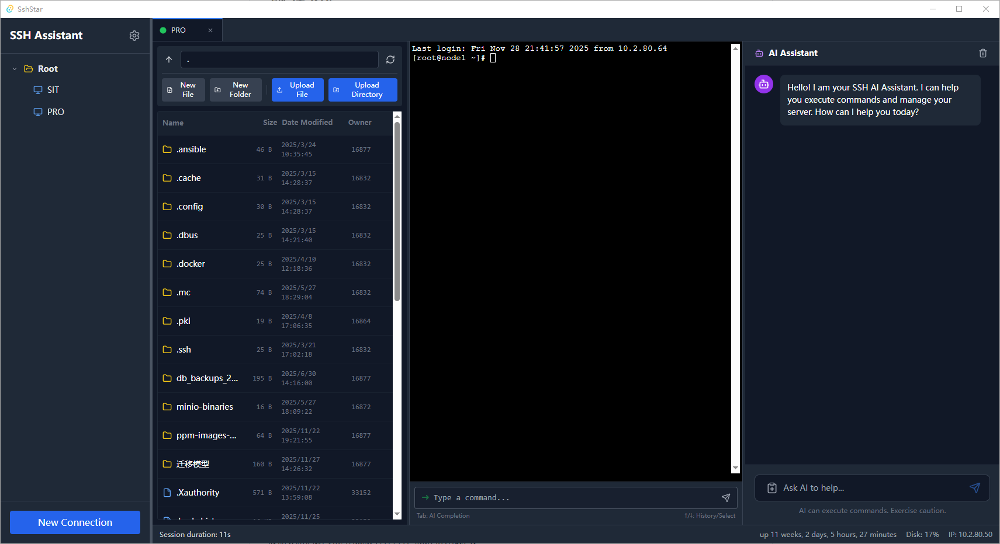

# SSH Assistant

**[中文](README.zh-CN.md)** | English

A modern SSH client built with Tauri + Vue 3 + TypeScript. It integrates powerful terminal functionality, AI intelligent assistant, and a full-featured file manager, designed to improve remote server management efficiency.



## ✨ Features

- **Connection Management**:
  - Create, edit, and delete SSH connections
  - Support password authentication
  - Support Jump Host/Bastion connections
  - Local persistent storage using SQLite

- **Session Management**:
  - Multi-tab support for managing multiple server sessions
  - Complete isolation between sessions
  - Each session integrates terminal, file management, and AI assistant

- **Smart Terminal**:
  - Full-featured terminal based on xterm.js
  - Traditional Tab auto-completion
  - **AI Smart Completion**: Context-aware intelligent command suggestions

- **File Management**:
  - Remote file browsing, upload, and download
  - Drag-and-drop support for uploads and downloads
  - File/directory creation, deletion, and renaming
  - Local editing of remote files (auto download -> monitor changes -> auto upload)
  - Resume transfer and file integrity verification

- **AI Assistant**:
  - Context-aware intelligent conversations
  - Execute terminal commands directly in chat interface
  - Configurable AI model parameters (API address, key, model name)

- **Personalization**:
  - Multi-language support (Chinese/English)
  - UI theme switching
  - Custom AI completion and chat configuration

## 🛠️ Tech Stack

- **Core Framework**: [Tauri v2](https://tauri.app/) (Rust)
- **Frontend Framework**: [Vue 3](https://vuejs.org/) + [TypeScript](https://www.typescriptlang.org/)
- **Build Tool**: [Vite](https://vitejs.dev/)
- **Styling Library**: [TailwindCSS](https://tailwindcss.com/)
- **State Management**: [Pinia](https://pinia.vuejs.org/)
- **Terminal Component**: [xterm.js](https://xtermjs.org/)
- **Icon Library**: [Lucide Vue](https://lucide.dev/)

## 🚀 Quick Start

### Prerequisites

Make sure your development environment has installed:

- [Node.js](https://nodejs.org/) (v16+)
- [Rust](https://www.rust-lang.org/tools/install) (for Tauri backend compilation)

### Install Dependencies

1. Clone the project:

    ```bash
    git clone <repository-url>
    cd ssh-ssistant
    ```

2. Install NPM dependencies:
    ```bash
    npm install
    ```

### Development Mode

Start the development server (with hot reload):

```bash
npm run tauri dev
```

This command will start the Vite frontend service and open the Tauri application window.

### Build Release

Build the production application:

```bash
npm run tauri build
```

The build artifacts will be generated in the `src-tauri/target/release/` directory.

## 📂 Project Structure

- `src/`: Frontend Vue source code
  - `components/`: Vue components (Terminal, FileManager, AIAssistant, etc.)
  - `stores/`: Pinia state management
  - `i18n/`: Internationalization resource files
- `src-tauri/`: Backend Rust source code
  - `src/`: SSH connections, file operations, and system interaction implementation
  - `tauri.conf.json`: Tauri configuration file

## 📝 License

[MIT](LICENSE)
