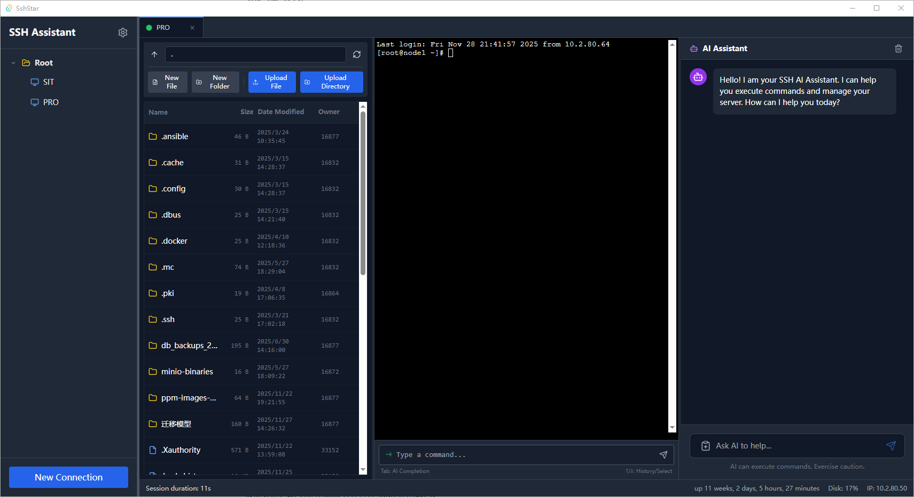

# SSH Assistant

基于 **Tauri 2 + Vue 3 + TypeScript + Rust** 构建的现代化 SSH 桌面工作台，面向开发者、运维和 DevOps 场景，提供终端、多会话、远程文件管理、SSH 隧道、资产中心、运维作业与 AI 助手等能力。

> 这个仓库不仅包含桌面客户端，还包含一个管理后台前端和一个管理后台 API。



## 这个项目里有什么

本仓库当前主要由 3 个部分组成：

### 1. 桌面端客户端
位置：`src/` + `src-tauri/`

这是项目的核心应用，一个基于 Tauri 的跨平台桌面 SSH 客户端，主要能力包括：

- SSH 连接管理
- 多标签会话与终端工作台
- 远程文件浏览、编辑、上传、下载
- SSH 隧道管理
- AI 助手与命令辅助
- 资产中心与访问端点管理
- 运维作业模板、批量执行、审计与同步能力
- 本地设置、会话、SSH 密钥、布局与快照持久化

### 2. 管理后台前端
位置：`admin/`

一个独立的 Vue 3 + Vite 管理台，当前从路由与页面结构上可以看到包含：

- 登录页
- 概览页
- 企业管理
- 子账号管理
- AI 订阅管理
- 账单管理
- AI 使用量管理
- 个人账号管理
- 全局策略页

### 3. 管理后台 API
位置：`backend/SshAssistant.AdminApi/`

一个基于 ASP.NET Core 的后台服务，当前包含：

- 管理端控制器
- 客户端同步控制器
- SQLite 数据存储
- OpenAPI 支持
- 账单周期后台服务

---

## 项目定位

SSH Assistant 不只是“能登录服务器的终端工具”，而是围绕服务器连接后的完整工作流来设计：

- 连接资产并建立 SSH 会话
- 在终端中执行命令
- 浏览和编辑远程文件
- 建立端口转发隧道
- 管理资产、环境、标签、凭据和访问入口
- 执行运维任务并记录审计日志
- 在 AI 上下文中辅助分析、解释和生成操作方案

---

## 核心能力

## 1. SSH 连接与会话

- 管理连接配置与历史连接
- 支持测试连接、连接、断开、重连
- 支持多标签并行会话
- 支持跳板机/堡垒机场景
- 支持会话状态跟踪与连接状态事件

## 2. 终端工作台

- 基于 `xterm.js` 的终端体验
- 支持终端写入、二进制写入、窗口尺寸调整
- 支持搜索和链接识别
- 支持会话级上下文工作区
- 支持 AI 与终端联动

## 3. 远程文件管理

- 基于 SFTP 浏览远程目录
- 支持分页列目录与远程搜索
- 支持读取、写入远程文件
- 支持创建目录、创建文件、重命名、删除
- 支持上传、下载、带进度传输
- 支持暂停、恢复、取消传输
- 支持传输记录与历史清理

## 4. SSH 隧道

- 支持本地端口转发
- 支持远程端口转发
- 支持动态端口转发
- 支持查看活动隧道与启停管理

## 5. AI 助手

- 会话内聊天与上下文感知问答
- 可结合终端上下文和文件路径辅助分析
- 支持命令建议与执行辅助
- 支持自定义 AI 接口地址、模型和参数
- 内置基础危险命令拦截逻辑，避免高风险误执行

## 6. 资产中心 / 运维能力

从前端主界面与 Rust 命令注册可以看出，桌面端已包含较完整的资产与运维模块：

- 主机资产管理
- 资产文件夹、环境、标签管理
- 访问端点与凭据引用管理
- 收藏、最近访问与保存视图
- 运维作业模板与批量执行
- 审计事件记录与查询
- 本地工作区快照导入导出
- 同步状态、变更日志与服务配置

## 7. 系统信息与辅助功能

- 获取远程系统状态
- 获取服务器状态与磁盘使用情况
- SSH 密钥生成、保存、删除、安装
- 本地设置持久化
- 国际化支持
- 深链接、对话框、文件系统与拖拽插件集成

---

## 技术栈

### 桌面客户端前端

- `Vue 3`
- `TypeScript`
- `Vite`
- `Pinia`
- `TailwindCSS`
- `xterm.js`
- `Monaco Editor`
- `vue-i18n`
- `@tanstack/vue-virtual`

### 桌面客户端后端

- `Tauri 2`
- `Rust 2021`
- `tokio`
- `ssh2`
- `rusqlite`
- `serde`

### 管理后台

- `Vue 3`
- `Vue Router`
- `Vite`
- `TailwindCSS`

### 管理后台 API

- `ASP.NET Core`
- `.NET 10`
- `Entity Framework Core`
- `SQLite`

---

## 仓库结构

```text
ssh-ssistant-tauri/
├── src/                               # 桌面端前端（Vue 3 + TS）
│   ├── components/                    # 终端、文件管理、AI、资产中心等组件
│   ├── composables/                   # 可复用逻辑
│   ├── i18n/                          # 国际化资源
│   ├── services/                      # 前端服务层
│   ├── stores/                        # Pinia 状态管理
│   └── App.vue                        # 桌面端主界面
├── src-tauri/                         # 桌面端后端（Tauri + Rust）
│   └── src/
│       ├── lib.rs                     # Tauri 初始化与命令注册
│       ├── db.rs                      # 本地 SQLite 初始化与迁移
│       ├── models.rs                  # 数据模型
│       ├── ops.rs                     # 资产/运维/同步/审计/AI 相关命令
│       ├── system.rs                  # 系统辅助能力
│       └── ssh/                       # SSH、终端、SFTP、隧道、传输等核心逻辑
├── admin/                             # 管理后台前端
├── backend/
│   └── SshAssistant.AdminApi/         # 管理后台 API
├── scripts/                           # 校验与辅助脚本
├── docs/ doc/                         # 文档目录
├── public/                            # 静态资源
├── package.json                       # 桌面端前端依赖与脚本
└── README.md
```

---

## 桌面端架构说明

桌面客户端采用“前端 UI + Rust 原生能力”分层：

- `src/` 负责界面、状态管理、交互流程和 AI UI
- `src-tauri/src/lib.rs` 注册 Tauri 命令
- `src-tauri/src/ssh/` 负责 SSH、SFTP、PTY、隧道、传输、重连、监控等核心实现
- `src-tauri/src/db.rs` 负责本地 SQLite 表结构与设置迁移
- `src-tauri/src/ops.rs` 负责资产、作业、审计、同步和 AI 相关业务命令

应用启动时会初始化本地数据库、运维相关数据结构，并注册一系列桌面调用命令。

---

## 数据与持久化

桌面端会在本地保存部分数据，主要包括：

- 连接信息
- 资产与访问端点信息
- SSH 密钥记录
- 用户设置
- AI 配置
- 同步配置
- 本地工作区快照
- 隧道配置

桌面端本地数据库由 Rust 后端在应用数据目录下创建和维护。

管理后台 API 也使用独立的 SQLite 数据库。

---

## 开发环境要求

### 桌面端

- Node.js 16+
- npm
- Rust stable toolchain
- Tauri 构建所需系统依赖

### 管理后台前端

- Node.js
- npm

### 管理后台 API

- .NET SDK 10

---

## 快速开始

## 1. 安装桌面端依赖

```bash
npm install
```

## 2. 启动桌面端前端开发服务器

```bash
npm run dev
```

## 3. 启动桌面端 Tauri 开发模式

```bash
npm run tauri dev
```

## 4. 构建桌面端

```bash
npm run build
```

## 5. 构建桌面应用

```bash
npm run tauri build
```

---

## 根目录常用脚本

| 命令 | 说明 |
| --- | --- |
| `npm run dev` | 启动桌面端前端开发服务器 |
| `npm run build` | 执行类型检查并构建桌面端前端 |
| `npm run preview` | 预览前端构建结果 |
| `npm run tauri dev` | 启动桌面端 Tauri 开发模式 |
| `npm run sync:version` | 同步版本信息 |
| `npm run version` | 触发版本同步脚本 |
| `npm run verify:g4` | 校验 G4 相关流程 |
| `npm run verify:g3` | 校验 billing / AI 流程 |
| `npm run verify:enterprise` | 校验企业版相关流程 |
| `npm run i18n:check` | 检查国际化资源 |

---

## 管理后台开发

进入 `admin/` 目录后可使用：

```bash
npm install
npm run dev
npm run build
```

该部分是一个独立的前端项目，不与根目录前端共用构建脚本。

---

## 管理后台 API 开发

进入 `backend/SshAssistant.AdminApi/` 后，可按标准 ASP.NET Core 方式运行。

例如：

```bash
dotnet run
```

开发环境下启用 OpenAPI，默认使用本地 SQLite 数据库存储管理端数据。

---

## 当前比较重要的目录

如果你刚接手这个仓库，建议优先从这些位置开始：

- `src/App.vue`：桌面端整体工作台布局与主流程
- `src/components/`：终端、文件管理、AI、资产中心等主界面组件
- `src/stores/`：会话、设置、通知、传输、隧道等状态管理
- `src/services/`：前端调用服务封装
- `src-tauri/src/lib.rs`：桌面端命令入口
- `src-tauri/src/ssh/`：SSH/SFTP/终端/隧道/传输核心实现
- `src-tauri/src/db.rs`：桌面端本地数据库与配置迁移
- `src-tauri/src/ops.rs`：资产、同步、审计、作业与 AI 能力
- `admin/src/`：管理后台前端页面与路由
- `backend/SshAssistant.AdminApi/`：管理端 API、数据层与服务层

---

## 适用场景

- 日常 SSH 登录与多服务器管理
- 远程文件上传、下载、编辑
- 资产化管理服务器与访问入口
- 通过 SSH 隧道暴露或访问服务
- 运维批量执行与审计记录
- 将 AI 能力接入服务器运维工作流
- 面向企业或团队的账户、订阅与同步扩展

---

## 说明

- 桌面端是当前仓库最核心、最完整的主体。
- 仓库同时包含管理后台与后台 API，适合继续向企业化、多账户、订阅和云同步方向扩展。
- AI 相关能力依赖用户或平台侧配置的模型服务。
- 一些校验脚本和文档目录体现出该项目仍在持续演进中。

如果你愿意，我下一步还可以继续帮你：

1. 再补一份 **英文 README**
2. 把 `README.md` 和 `README.zh-CN.md` 统一整理
3. 额外写一份“项目结构导读”供新人快速上手
