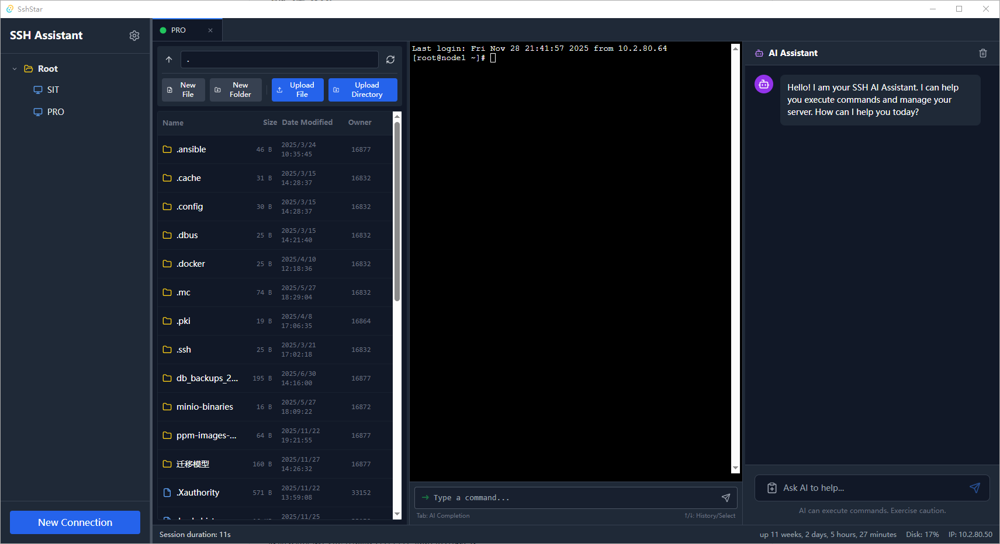

# SSH Star

中文 | **[English](README.md)**

现代化 SSH 客户端，为现代开发者打造

[](https://opensource.org/licenses/MIT)
[](https://tauri.app/)
[](https://vuejs.org/)
[](https://www.rust-lang.org/)
[](https://www.typescriptlang.org/)

---

## 项目简介

**SSH Star** 是一款基于 [Tauri 2](https://tauri.app/)、[Vue 3](https://vuejs.org/) 和 [TypeScript](https://www.typescriptlang.org/) 构建的现代化 SSH 客户端。它将原生应用的强大性能与 Web 技术的灵活性完美结合，为您带来无与伦比的服务器管理体验。

专为开发者、系统管理员和 DevOps 工程师设计，SSH Star 提供了一个统一的平台，集成了 SSH 连接、终端操作、文件管理和 AI 辅助工作流。

### 核心亮点

- **极速性能** - 基于 Rust 的后端和优化的 Vue 3 前端
- **功能丰富** - 所需功能一应俱全：终端、文件管理、AI 助手、隧道
- **现代界面** - 简洁直观的用户界面，支持深色/浅色主题
- **安全可靠** - 本地数据存储，支持加密 SSH 密钥
- **跨平台** - 支持 Windows、macOS 和 Linux
- **AI 赋能** - 集成 AI 助手，提供智能命令建议和自动化



---

## 核心功能

### 连接管理

**全面的 SSH 连接支持**
- 支持 SSHv2 协议，密码和密钥认证
- 跳板机/堡垒机连接，支持复杂网络拓扑
- 连接分组管理，支持层级结构
- 快速连接常用服务器
- 连接测试功能
- 智能自动重连，可配置重试策略

### 智能终端

**多标签页会话管理**
- 同时管理多个服务器会话
- 基于 xterm.js 的全功能终端模拟器
- UTF-8 完整支持，正确的字符编码
- 智能自动补全，支持 AI 增强建议
- Zmodem 协议支持 sz/rz 文件传输
- 强大的搜索和导航功能
- 可调整大小的终端窗格

### 高级文件管理

**SFTP 文件操作**
- 无缝浏览、上传和下载远程文件
- 拖拽支持，直观的文件传输
- 本地编辑远程文件，自动上传保存
- 文件权限和所有权管理
- 批量文件操作
- 支持断点续传
- 自动文件完整性校验

### AI 助手

**上下文感知智能助手**
- 理解当前会话和工作目录
- AI 驱动的命令推荐
- 从聊天界面直接执行命令
- 支持多种 AI 提供商（OpenAI、Claude、本地模型）
- 跨会话持久化聊天历史
- 可配置的模型参数

### SSH 隧道

**全面的端口转发**
- 本地端口转发
- 远程端口转发
- 动态端口转发（SOCKS 代理）
- 隧道创建、管理和监控
- 单个 SSH 连接复用支持多隧道

### 系统监控

**实时洞察**
- CPU、内存和磁盘使用监控
- 服务器健康检查
- 网络统计和传输速度
- 可配置的资源告警阈值

### SSH 密钥管理

**密钥操作**
- 生成 ED25519 和 RSA 密钥对
- 导入现有 SSH 密钥
- 自动安装密钥到远程服务器
- 安全的本地密钥管理

### 国际化

**多语言支持**
- 英语和简体中文
- 社区友好的翻译系统
- 易于添加新语言支持

---

## 技术栈

### 前端

- **框架**：[Vue 3](https://vuejs.org/) 使用 Composition API
- **语言**：[TypeScript](https://www.typescriptlang.org/) 5.6（严格模式）
- **构建工具**：[Vite](https://vitejs.dev/) 6.0
- **样式**：[TailwindCSS](https://tailwindcss.com/) 3.4
- **状态管理**：[Pinia](https://pinia.vuejs.org/) 3.0
- **UI 组件**：自定义组件，使用 [Lucide](https://lucide.dev/) 图标
- **终端**：[xterm.js](https://xtermjs.org/) 5.3 及多个插件
- **虚拟滚动**：[@tanstack/vue-virtual](https://tanstack.com/virtual) 提升性能
- **代码编辑器**：[Monaco Editor](https://microsoft.github.io/monaco-editor/) 用于文件编辑
- **国际化**：[Vue i18n](https://vue-i18n.intlify.dev/)

### 后端

- **框架**：[Tauri](https://tauri.app/) 2.0
- **语言**：Rust 2021 版本
- **异步运行时**：[Tokio](https://tokio.rs/) 1.0
- **SSH 库**：[ssh2](https://github.com/alexcrichton/ssh2-rs) 0.9，内建 OpenSSL
- **数据库**：[SQLite](https://www.sqlite.org/) 3.42 配合 [rusqlite](https://github.com/rusqlite/rusqlite)
- **序列化**：[serde](https://serde.rs/) 和 [serde_json](https://github.com/serde-rs/json)
- **文件系统**：Tauri 文件系统插件
- **跨平台**：针对 Windows/macOS/Linux 的平台特定优化

---

## 项目架构

```
ssh-star/
├── src/                          # 前端 Vue 3 + TypeScript
│   ├── components/               # Vue 组件
│   │   ├── TerminalView.vue      # xterm.js 终端界面
│   │   ├── FileManager.vue       # SFTP 文件管理器
│   │   ├── AIAssistant.vue       # AI 聊天界面
│   │   ├── SessionTabs.vue       # 标签页管理
│   │   ├── ConnectionList.vue    # 连接管理界面
│   │   ├── TunnelPanel.vue       # SSH 隧道管理
│   │   └── ...                   # 其他 UI 组件
│   ├── stores/                   # Pinia 状态管理
│   │   ├── sessions.ts           # 会话状态
│   │   ├── connections.ts        # 连接数据
│   │   ├── settings.ts           # 用户偏好
│   │   ├── transfers.ts          # 文件传输状态
│   │   ├── tunnels.ts            # 隧道状态
│   │   └── notifications.ts      # 通知系统
│   ├── i18n/                     # 国际化
│   │   ├── locales/
│   │   │   ├── en-US.ts          # 英文翻译
│   │   │   └── zh-CN.ts          # 中文翻译
│   ├── composables/              # Vue 组合式函数
│   ├── types/                    # TypeScript 类型定义
│   └── App.vue                   # 根组件
├── src-tauri/                    # 后端 Rust + Tauri
│   ├── src/
│   │   ├── lib.rs                # Tauri 主设置和命令处理
│   │   ├── ssh/                  # SSH 操作模块
│   │   │   ├── client.rs         # SSH 客户端实现
│   │   │   ├── connection.rs     # 连接管理
│   │   │   ├── terminal.rs       # PTY 操作
│   │   │   ├── file_ops.rs       # SFTP 文件操作
│   │   │   ├── tunnel.rs         # SSH 隧道
│   │   │   ├── keys.rs           # SSH 密钥管理
│   │   │   ├── manager.rs        # 会话管理器
│   │   │   ├── command.rs        # 命令执行
│   │   │   ├── system.rs         # 系统监控
│   │   │   ├── wsl.rs            # WSL 集成
│   │   │   └── transfer/         # 文件传输模块
│   │   │       ├── manager.rs    # 传输管理器
│   │   │       ├── async_sftp.rs # 异步 SFTP 操作
│   │   │       ├── state.rs      # 传输状态
│   │   │       └── checkpoint.rs # 传输检查点
│   │   ├── db.rs                 # 数据库操作
│   │   ├── models.rs             # 数据结构
│   │   └── system.rs             # 系统工具
│   ├── Cargo.toml                # Rust 依赖
│   └── tauri.conf.json           # Tauri 配置
├── package.json                  # Node.js 依赖
├── tsconfig.json                 # TypeScript 配置
├── tailwind.config.js            # TailwindCSS 配置
├── vite.config.ts                # Vite 构建配置
└── README.md                     # 本文件
```

---

## 快速开始

### 环境要求

确保您的开发环境已安装以下软件：

- **Node.js** - 版本 16.0 或更高 - [下载](https://nodejs.org/)
- **Rust** - 最新稳定版本 - [安装指南](https://www.rust-lang.org/tools/install)
- **Git** - 用于克隆仓库 - [下载](https://git-scm.com/)

### 安装 Rust

如果尚未安装 Rust：

```bash
# Unix-like 系统（macOS、Linux）
curl --proto '=https' --tlsv1.2 -sSf https://sh.rustup.rs | sh

# Windows
# 从 https://rustup.rs/ 下载并运行 rustup-init.exe
```

### 安装步骤

1. **克隆仓库**

   ```bash
   git clone https://github.com/yourusername/ssh-star.git
   cd ssh-star
   ```

2. **安装依赖**

   ```bash
   npm install
   ```

3. **运行开发模式**

   ```bash
   npm run tauri dev
   ```

   该命令将：
   - 启动 Vite 开发服务器
   - 编译 Rust 后端
   - 打开 Tauri 应用窗口
   - 启用前后端热重载

### 构建生产版本

构建完整应用：

```bash
npm run tauri build
```

构建产物位于：

- **Windows**：`src-tauri/target/release/bundle/nsis/`
- **macOS**：`src-tauri/target/release/bundle/dmg/`
- **Linux**：`src-tauri/target/release/bundle/appimage/`

### 开发脚本

| 命令 | 描述 |
|------|------|
| `npm run tauri dev` | 启动开发服务器（支持热重载） |
| `npm run dev` | 仅启动 Vite 前端服务器 |
| `npm run build` | 构建前端生产版本（包含类型检查） |
| `npm run tauri build` | 构建完整应用用于发布 |
| `npm run release:patch` | 创建补丁版本（自动递增版本号） |
| `npm run release:minor` | 创建次版本更新 |
| `npm run release:major` | 创建主版本更新 |

---

## 使用指南

### 首次使用

1. **创建连接**
   - 点击"新建连接"按钮
   - 填写连接信息：
     - 名称：连接的友好名称
     - 主机：服务器 IP 地址或主机名
     - 端口：SSH 端口（默认：22）
     - 用户名：SSH 用户名
     - 密码：SSH 密码（或使用密钥认证）
   - （可选）配置跳板机
   - 点击"保存"

2. **连接服务器**
   - 双击列表中的连接
   - 或选中后点击"连接"
   - 终端将自动打开

3. **打开文件管理器**
   - 点击会话中的"文件管理"标签
   - 浏览远程文件和文件夹
   - 拖拽文件进行上传/下载

4. **使用 AI 助手**
   - 点击"AI 助手"标签
   - 首先在设置中配置 AI API
   - 开始聊天并获得智能命令建议

### 连接分组

通过创建分组来组织连接：

1. 在连接列表中右键单击
2. 选择"新建分组"
3. 输入分组名称
4. 将连接拖入分组

### SSH 隧道

创建 SSH 隧道进行安全的端口转发：

1. 点击工具栏中的"隧道"按钮
2. 点击"新建隧道"
3. 配置隧道设置：
   - **本地**：`-L 本地端口:远程主机:远程端口`
   - **远程**：`-R 远程端口:本地主机:本地端口`
   - **动态**：`-D 本地端口`（SOCKS 代理）
4. 点击"启动"激活隧道

### 键盘快捷键

| 快捷键 | 操作 |
|--------|------|
| `Ctrl+T` | 新建终端标签 |
| `Ctrl+W` | 关闭当前标签 |
| `Ctrl+Tab` | 切换到下一个标签 |
| `Ctrl+Shift+Tab` | 切换到上一个标签 |
| `Ctrl++` | 增大终端字体 |
| `Ctrl+-` | 减小终端字体 |
| `Ctrl+0` | 重置终端字体大小 |

---

## 配置说明

### 应用设置

设置存储在本地，可通过设置菜单配置：

**外观**
- 主题（浅色/深色）
- 语言
- 字体大小

**终端**
- 字体系列
- 光标样式
- 滚动历史大小

**编辑器**
- 字体系列
- Tab 大小
- 自动换行

**AI**
- API 端点
- API 密钥
- 模型名称
- 温度参数

**传输**
- 缓冲区大小
- 并发传输数
- 重试次数

**高级**
- 调试模式
- 日志级别

### 数据库

SSH Star 使用 SQLite 进行本地数据持久化：

数据库位置：
- **Windows**：`C:\Users\<用户名>\AppData\Roaming\com.jieok.sshstar\`
- **macOS**：`~/Library/Application Support/com.jieok.sshstar/`
- **Linux**：`~/.config/com.jieok.sshstar/`

### 环境变量

可选的环境变量用于高级配置：

```bash
# Rust 回溯用于调试
RUST_BACKTRACE=1

# 日志级别
RUST_LOG=debug

# 自定义 Tauri 配置路径
TAURI_CONFIG_PATH=/path/to/config
```

---

## 常见问题

### Q: 如何使用 SSH 密钥认证代替密码？

1. 进入设置 → SSH 密钥
2. 点击"生成新密钥"或导入现有密钥
3. 选择密钥类型（推荐 ED25519）
4. 保存密钥
5. 在连接设置中，选择"密钥认证"并选择您的密钥
6. 如需自动安装，启用"在远程服务器上安装密钥"

### Q: 为什么文件传输失败，提示"权限被拒绝"？

通常原因：
- 用户在远程目录没有写入权限
- 磁盘已满
- 文件已存在且无法覆盖

请在文件管理器中检查文件权限，确保您有必要的权限。

### Q: 可以为 SSH 连接使用代理服务器吗？

可以！使用 SSH 动态端口转发：
1. 创建新隧道
2. 选择"动态"作为隧道类型
3. 设置本地端口（如 1080）
4. 启动隧道
5. 配置应用程序使用 localhost:1080 的 SOCKS 代理

### Q: 如何启用 AI 功能？

1. 打开设置 → AI 配置
2. 输入 API 端点（如 https://api.openai.com/v1）
3. 输入 API 密钥
4. 选择模型（如 gpt-4、claude-3-opus）
5. 根据需要调整温度和最大令牌数
6. 点击"测试连接"验证

### Q: 应用在连接时崩溃，该怎么办？

1. 查看控制台日志获取错误信息
2. 验证连接详细信息是否正确
3. 在终端中使用 `ssh` 命令测试连接
4. 尝试清除应用缓存
5. 在 GitHub 上报告问题并附上日志

---

## 贡献指南

我们欢迎社区贡献！以下是参与方式：

### 报告 Bug

- 先搜索现有问题
- 使用 Bug 报告模板
- 包含以下信息：
  - 操作系统和版本
  - SSH Star 版本
  - 复现步骤
  - 预期行为与实际行为
  - 日志和截图

### 提出功能建议

- 检查功能是否已存在
- 使用功能请求模板
- 说明用例和优势
- 尽可能提供示例

### 提交 Pull Request

1. Fork 仓库
2. 创建功能分支（`git checkout -b feature/amazing-feature`）
3. 进行更改
4. 编写/更新测试（如适用）
5. 确保代码通过类型检查（`npm run build`）
6. 提交更改（`git commit -m '添加某个功能'`）
7. 推送到分支（`git push origin feature/amazing-feature`）
8. 打开 Pull Request

### 开发指南

- 遵循现有代码风格
- 使用 TypeScript 严格模式
- 编写有意义的提交信息
- 根据需要更新文档
- 充分测试您的更改

---

## 已知问题

- ZModem 传输可能在某些终端模拟器上无法正常工作
- 某些终端配色方案可能在集成终端中显示不正确
- 大文件上传（>2GB）可能需要在设置中增加缓冲区大小

完整列表请参阅 [GitHub Issues](https://github.com/yourusername/ssh-star/issues)。

---

## 开源协议

本项目采用 MIT 许可证 - 详见 [LICENSE](LICENSE) 文件。

```
MIT License

Copyright (c) 2024 SSH Star 贡献者

Permission is hereby granted, free of charge, to any person obtaining a copy
of this software and associated documentation files (the "Software"), to deal
in the Software without restriction, including without limitation the rights
to use, copy, modify, merge, publish, distribute, sublicense, and/or sell
copies of the Software, and to permit persons to whom the Software is
furnished to do so, subject to the following conditions:

The above copyright notice and this permission notice shall be included in all
copies or substantial portions of the Software.

THE SOFTWARE IS PROVIDED "AS IS", WITHOUT WARRANTY OF ANY KIND, EXPRESS OR
IMPLIED, INCLUDING BUT NOT LIMITED TO THE WARRANTIES OF MERCHANTABILITY,
FITNESS FOR A PARTICULAR PURPOSE AND NONINFRINGEMENT. IN NO EVENT SHALL THE
AUTHORS OR COPYRIGHT HOLDERS BE LIABLE FOR ANY CLAIM, DAMAGES OR OTHER
LIABILITY, WHETHER IN AN ACTION OF CONTRACT, TORT OR OTHERWISE, ARISING FROM,
OUT OF OR IN CONNECTION WITH THE SOFTWARE OR THE USE OR OTHER DEALINGS IN THE
SOFTWARE.
```

---

## 致谢

- [Tauri](https://tauri.app/) - 构建桌面应用的优秀框架
- [Vue.js](https://vuejs.org/) - 渐进式 JavaScript 框架
- [xterm.js](https://xtermjs.org/) - 优秀的 Web 终端模拟器
- [ssh2-rs](https://github.com/alexcrichton/ssh2-rs) - Rust SSH 客户端库
- 所有 SSH Star 的贡献者和用户！

---

## 支持与社区

- **GitHub**：https://github.com/yourusername/ssh-star
- **问题反馈**：https://github.com/yourusername/ssh-star/issues
- **讨论区**：https://github.com/yourusername/ssh-star/discussions

---

**使用 Tauri + Vue 3 精心打造**
